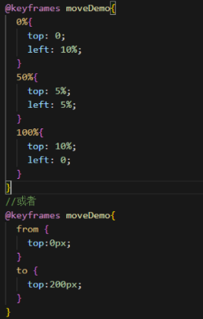

# 过渡与动画

Animate 库网站：
[Animate.css | A cross-browser library of CSS animations.](https://animate.style/)https://animate.style/

## transform

> 此属性允许旋转、缩放、倾斜或平移给定元素。这是通过修改 CSS 视觉格式化模型的坐标空间来实现的。

eg. 我们可以使用  `transform: scale(2);`  来将元素的大小放大两倍，或使用  `transform: rotate(45deg);`  来旋转元素 45 度。

## transition

> 此属性是 CSS3 的一个新特性，它可以在一定的时间内平滑地改变 CSS 属性的值。

> 主要应用：使浏览器在一个属性值逐渐改变成另一个属性值时，可以创建出过渡的动画效果。

eg. 我们可以使用  `transition: all 2s;`  来设置一个元素的所有属性在两秒内从当前值过渡到新值。

Transition-group  是 Vue 提供的一个特殊组件，用于管理 **多个元素或组件** 的过渡效果。

这个组件用来对列表中元素的添加（进入）和删除（离开）进行动画的封装。

主要属性和功能：

- `name`：用作过渡类名的前缀。也就是说，实际上你在这个元素上会看到诸如  `.xxx-enter` , `.xxx-enter-active`, `.xxx-leave-active`  这样的类名，其中的  `xxx`  就是  `name`  属性的值。
- `tag`：当你希望 `<transition-group>` 渲染为特定类型的 HTML 标签时，可以使用 tag 属性来指定。如果不指定，则默认渲染为 `<span>` 标签。
- `move-class`：在 `<transition-group>` 中，当列表项改变其位置时，会应用一个特殊的过渡类名，默认是 .v-move。如果需要自定义这个移动过渡效果，可以通过 move-class 属性来设置自定义的类名。

<font color=Red>注：</font> 
transition-group  的用法和 Vue 其他组件略有不同，它会渲染一个真实的 DOM 元素：默认为一个  `<span>`  元素，这个元素可以通过  tag  属性进行修改。

eg.

```html
<transition-group name="list" tag="ul">
  <li v-for="item in items" :key="item">{{ item }}</li>
</transition-group>
```

上述代码中，我们定义了一个列表的过渡动画，每次列表项的增加或删除，都会有相应的动画效果。

## @keyframes

> 这个 CSS 关键帧规则，它能够创建复杂的、多阶段的动画。

在  `@keyframes`  中，可以定义一个动画的各个阶段，以及每个阶段的样式。然后可以使用  `animation`  属性来调用定义好的  `@keyframes`  动画。

eg. 可以使用  `@keyframes move { 0% { top: 0;} 100% { top: 200px; } }`  来创建一个元素从 top 0px 移动到 200px 的动画。

它还使用了关键字`@keyframes`来定义动画。这里可以用`from{}to{}`或者用百分比充当时间点。具体格式为：

```css
/* slidein为动画名称 */
@keyframes slidein {
  from {
    transform: translateX(0%);
  }

  to {
    transform: translateX(100%);
  }
}
```



比如需要给 div 添加动画效果：

```css
/*动画速度曲线*/
 /*animation-timing-function: linear;
   linear 匀速
   ease 先慢后快，默认
   ease-in 慢速开始
   ease-out 慢速结束
   ease-in-out 开始和结束都慢*/

/* 前两个数据含义：运动总时间 延迟的动画时间（单位是秒或者毫秒） */
/* animation是所有动画属性的简写，除了animation-play-state属性 */
div{
	animation：1s 2s 动画名称 运动方式 动画执行的次数
}
```

## 区别

- `transform`  是用于改变元素的形状和位置，例如旋转和缩放等。
- `transition`  是用于控制属性值的变化速度，以创建平滑的动画效果。
- `@keyframes`  则是用于定义复杂的、可以有多个阶段的动画。

它们常常被组合使用来创建复杂的动画效果。例如我们可以使用  `transform`  来定义动画的每个阶段，使用  `transition`  来控制动画的速度，最后通过  `@keyframes`  来集合这些阶段，创建出一整个完整的动画。

## Vue 封装的过渡与动画

### 作用

在插入、更新或移除 DOM 元素时，在合适的时候给元素添加样式类名。

### 写法:

#### ① 准备好样式 :

```
-元素进入的样式:
v-enter:进入的起点
v-enter-active:进入过程中
v-enter-to:进入的终点
-元素离开的样式:
v-leave:离开的起点
v-leave-active:离开过程中
v-leave-to:离开的终点
```

#### ② 使用`<transition>`包裹要过渡的元素，并配置 name 属性:

```html
<transition name="hello">
  <h1 v-show="isShow">你好啊!</h1>
</transition>
```

若有多个元素需要过度，则需要使用: `<transition-group>`，且每个元素都要指定 key 值
