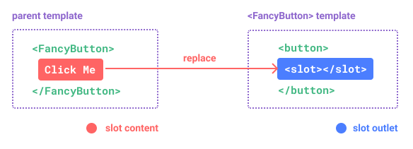
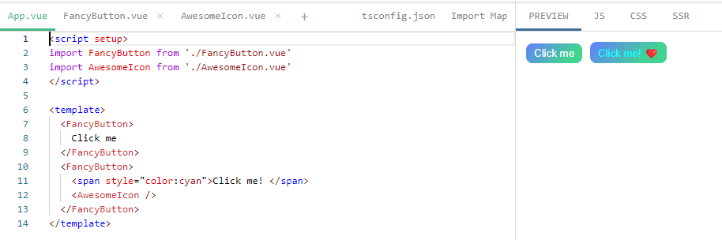
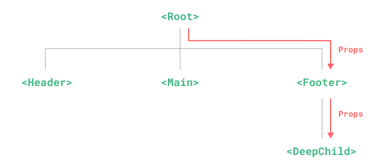
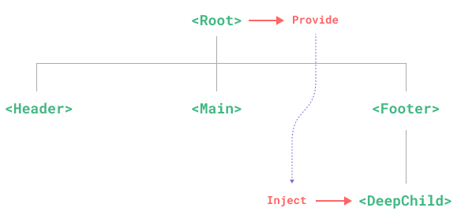

官方文档：https://v3.cn.vuejs.org/

## 注册与命名

如果没有使用 `<script setup>`，则需要使用 `components` 选项来显式注册：

```js
import ComponentA from "./ComponentA.js";

export default {
  components: {
    ComponentA,
  },
  setup() {
    // ...
  },
};
```

如果是`<script setup>` 的单文件组件中，导入的组件就可以直接在模板中使用，不用注册：

```vue
<script setup>
import ComponentA from "./ComponentA.vue";
</script>

<template>
  <ComponentA />
</template>
```

组件名命名格式 ​:`<MyComponent>` 或 `<my-component>`。

## 传参

### 单向绑定

#### props

> 所有的 props 都遵循单向绑定原则，它是**只读**的，只会因父组件的更新变化，自然地将新的状态向下流往子组件，而不会逆向传递。

所有 prop 默认都是可选的，除非声明了 required: true。除 Boolean 外的未传递的可选 prop 将会有一个默认值 undefined。

但如果使用了基于类型的 prop 声明 ，Vue 会尽最大努力在运行时按照 prop 的类型标注进行编译。举例来说，`defineProps<{ msg: string }> `会被编译为` { msg: { type: String, required: true }}`。

#### 触发与监听事件 ​：

> 在组件的模板表达式中，可以直接使用 $emit 方法触发自定义事件 (如下面组件里用在 v-on 的处理函数中)。也可以写带参数的和搭配 ts 方式写的，详情看官方文档。

父组件（dict-id 编译时会自动转化为 dictId，只是这种写法增加了可读性）：

```vue
<DictionaryTableModal
  :visible="modalvisible"
  @modelClose="modalvisible = false"
  @refreshModel="refreshList"
  :tableData="tableData"
  :dict-id="dictId"
></DictionaryTableModal>

<script setup lang="ts">
const tableData = ref(tableList.value[0]);
<!-- 这里的dictId是它的父组件传过来的，它还要传给它的子组件 -->
const dictId = toRef(props, 'dictId'); const modalvisible = ref(false);
</script>
```

子组件（vue3+ts 写法）：

```vue
// 如果是在上面用
<a-modal @cancel="$emit('modelClose')" />

<script setup lang="ts">
const props = defineProps<{
  visible: boolean;
  tableData?: IDictionaryItem;
  dictId: number;
}>();

// 如果是在下面使用，则通过 defineEmits() 宏来声明它要触发的事件
const emit = defineEmits(["modelClose", "refresh-list"]);

const onFinish = () => {
  emit("modelClose");
  emit("refreshModel");
};
</script>
```

### 双向绑定

v-model 可以在组件上使用以实现双向绑定。v-model 有一些内置的修饰符，例如 .trim，.number 和 .lazy。

从 Vue 3.4 开始，推荐的实现方式是使用 defineModel() 宏：

```vue
<!-- Child.vue -->
<script setup>
const firstName = defineModel("firstName");
const lastName = defineModel("lastName");
</script>

<template>
  <input type="text" v-model="firstName" />
  <input type="text" v-model="lastName" />
</template>
```

父组件可以用 v-model 绑定一个值：

```vue
<!-- Parent.vue -->
<UserName v-model:first-name="first" v-model:last-name="last" />
```

## 插槽

> 插槽就是把常见的组件组合方式抽象成模版，组件可以按插槽名插到模版指定位置

> `<slot>` 元素用于定义组件的内容分发点。当父组件使用子组件时，可以在子组件标签内使用 template 标签配合 #slotName 的语法来定义插槽内容，这些内容将会被插入到子组件中对应名称的 `<slot name="slotName">` 位置。

比如，需要插进去的内容（可以多次复用的）：

```html
<FancyButton>
  Click me!
  <!-- 插槽内容 -->
</FancyButton>
```

留了个空位：

```html
<button class="fancy-btn">
  <slot></slot>
  <!-- 插槽出口 -->
</button>
```

`<slot>` 元素就是一个插槽出口 ，标示了它将在哪里被渲染。


最后渲染出来的效果：`<button class="fancy-btn">Click me!</button>`

也可以加上组件来渲染

```html
<FancyButton>
  <span style="color:red">Click me!</span>
  <AwesomeIcon name="plus" />
</FancyButton>
```

AwesomeIcon.vue：

```html
<template>❤️</template>
```

渲染出来的效果对比：


示例二：

```vue
<ListContainerVue>
  //具名插槽
  <template #content>
    <!-- 这里是将要插入到 ListContainerVue 组件“content”插槽中的内容 -->
  </template>
</ListContainerVue>

<script lang="ts" setup>
import ListContainerVue from "@/components/ListContainer.vue";
</script>
```

然后就在 子组件 ListContainer.vue 里面写

```vue
<!-- 子组件 (ListContainerVue) 定义 -->
<template>
  <!-- ...其它HTML结构... -->
  <div>
    <!-- 插槽位置，任何传递给 "content" 名称的插槽内容将显示在这里 -->
    <slot name="content"></slot>
  </div>
  <!-- ...其它HTML结构... -->
</template>
```

这样，父组件就可以自定义子组件的特定部分内容了。

当某些场景下插槽的内容可能想要同时使用父组件域内和子组件域内的数据可以使用作用域插槽。详情见官方文档。

## 依赖注入

如果用 props，要把爷爷的传给孙子就得逐级传，哪怕这里的 `<Footer>` 组件可能根本不关心这些 props，但为了孙子能访问，它还是得传一次。所以很麻烦


但 `provide` 和 `inject` 可以帮助我们解决这一问题。 一个父组件相对于其所有的后代组件，会作为依赖提供者。任何后代的组件树，无论层级有多深，都可以注入由父组件提供给整条链路的依赖。


### Provide (提供)

要为组件后代提供数据，需要使用到 provide() 函数：

```js
import { ref, provide } from 'vue'

const count = ref(0)
provide() 接收两个参数。第一个参数为注入名，第二个参数是提供的值，可以是任意类型。
provide('key', count)
```

后代组件会用注入名来查找期望注入的值。一个组件可以多次调用 provide()，使用不同的注入名，注入不同的依赖值。

### Inject (注入)

```vue
<script setup>
import { inject } from "vue";
const message = inject("message");
</script>
```

当提供 / 注入响应式的数据时，建议尽可能将任何对响应式状态的变更都保持在供给方组件中。当需要在注入方组件中更改数据时，推荐在供给方组件内声明并提供一个更改数据的方法函数。

### 使用 Symbol 作注入名 ​

当构建大型的应用包含非常多的依赖提供，或者正在编写提供给其他开发者使用的组件库，建议最好使用 Symbol 来作为注入名以避免潜在的冲突。
详情见官方文档。
TypeScript 用户请参考：https://cn.vuejs.org/guide/typescript/composition-api.html#typing-provide-inject

## 异步组件

> 在大型项目中，我们可能需要拆分应用为更小的块，并仅在需要时再从服务器加载相关组件。

Vue 提供了 defineAsyncComponent 方法来实现此功能,ES 模块动态导入也会返回一个 Promise,所以多数情况下我们会将它和 defineAsyncComponent 搭配使用。defineAsyncComponent 方法接收一个返回 Promise 的加载函数。

```js
import { defineAsyncComponent } from "vue";

const AsyncComp = defineAsyncComponent(() => {
  return new Promise((resolve, reject) => {
    // ...从服务器获取组件
    resolve(/* 获取到的组件 */);
  });
});
// ... 像使用其他一般组件一样使用 `AsyncComp`
```
