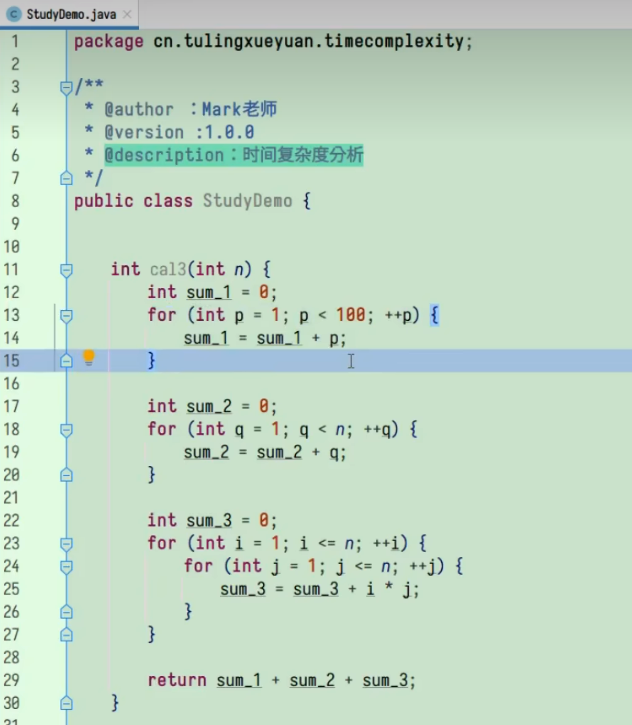
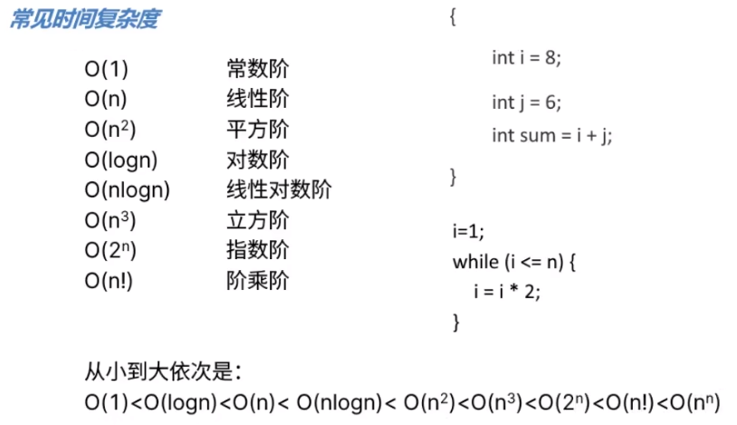
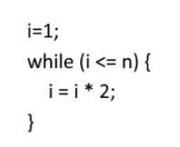
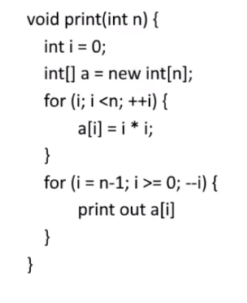

# 复杂度

## 时间复杂度

### 时间复杂度分析

- 只关注循环执行次数最多的一段代码
- 总复杂度=最高阶项的复杂度
- 嵌套代码的复杂度=嵌套内外代码复杂度的乘积

推导大 O 阶:

1. 用常数 1 取代运行时间中的所有加法常数。
2. 在修改后的运行次数函数中,只保留最高阶项。
3. 如果最高阶项存在且不是 1，则去除与这个项相乘的常数。得到的结果就是大 O 阶。

eg.

假设每行代码执行时间为 t

所以 T(n)=100t+nt+n²t=(n²+n+100)t

由 2 得，时间复杂度为 O(n²)



> 时间复杂度 O(logn)一般是怎么出现的？

eg.



在这个循环里面每循环一次 i 就\*2，所以会一直变为 2、2²、……直到循环结束。

所以 2 的 x 次方=n，想知道执行了多少次就得知道 x 为多少。

即 x=log2n(这里的 2 为底数，n 为对数)

但无论底数是多少，都会把对数样式的时间复杂度统一记为 logn

则这里的时间复杂度也是 O(logn)

## 空间复杂度

空间复杂度计算的是额外开辟的变量的个数

函数运行时所需要的栈空间(存储参数、局部变量、一些寄存器信息等)在编译期间已经确定好了，因此空间复杂度主要通过函数在运行时候显式申请的额外空间来确定。



```python
# O(1)
def f1(n):
    j = 0
    for i in range(n):
        j += 1
    return j

# O(n)
def f2(n):
    a = []
    for i in range(n):
        a.append(i)
    return a
```

在第一个函数中，所需开辟的内存空间并不会随着 n 的变化而变化，即此算法空间复杂度为一个常量，所以表示为 O(1)。在第二个函数中，随着 n 的增大，开辟的内存大小呈线性增长，这样的算法空间复杂度为 O(n)。在递归的时候，会出现空间复杂度为 logn 的情况，比较特殊。
