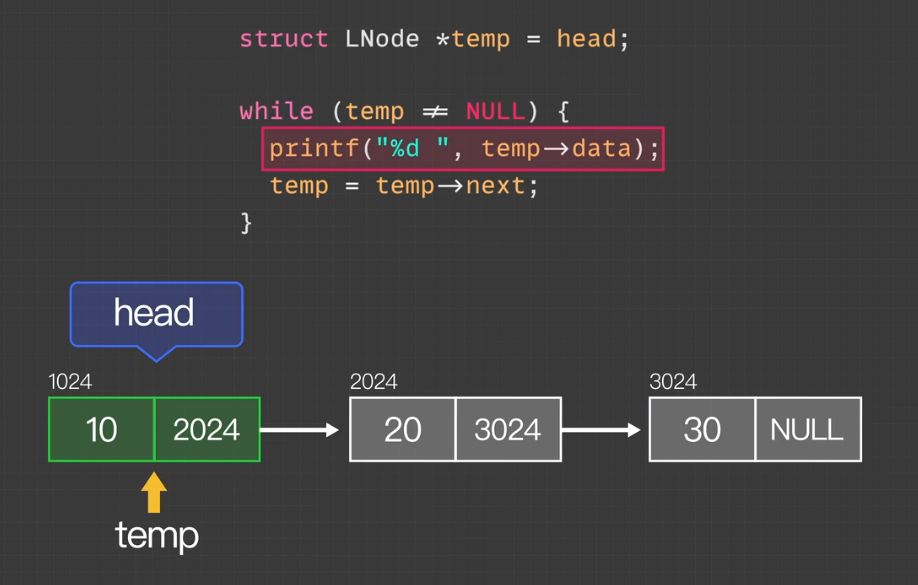
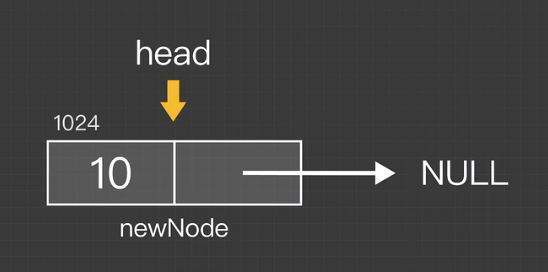

## 如何获取链表中的每个值？

先创建一个临时指针 temp 并把头节点的地址分配给它。然后它在循环里面逐级遍历，遍历链表直到 temp 指到地址为 NULL 的节点为止。

eg.

# 链表

## 赋值

> 链表中的赋值操作实际上是将一个变量**指向**某个节点对象，**而不是**创建一个新的节点对象。当我们将一个节点赋值给头结点或尾节点时，实际上是让头结点或尾节点指向同一个节点对象。

在链表中，头结点和尾节点是用来跟踪链表的起始和结束位置的指针。通过将头结点和尾节点指向同一个节点对象，我们确保链表中只有一个节点，并且该节点既是头结点又是尾节点。这样做有助于在链表末尾执行插入操作时保持链表的一致性。

## 单链表头插法

链表中的赋值操作实际上是将一个变量指向某个节点对象，而不是创建一个新的节点对象。当我们将一个节点赋值给头结点或尾节点时，实际上是让头结点或尾节点指向同一个节点对象。

在 JavaScript 中，对象、数组和函数都是通过引用传递的。当我们将一个对象赋值给另一个变量时，实际上是将引用复制给了新的变量，而不是创建了一个新的对象。因此，当我们修改其中一个变量所引用的对象时，另一个变量也会反映这个变化。

在链表中，头结点和尾节点是用来跟踪链表的起始和结束位置的指针。通过将头结点和尾节点指向同一个节点对象，我们确保链表中只有一个节点，并且该节点既是头结点又是尾节点。这样做有助于在链表末尾执行插入操作时保持链表的一致性。

## 单链表头插法

1. 创建节点
2. 使新节点指向 head
3. 使 head 指向新节点
   

## 单链表删除

先把后一节点变为头节点再删除头结点

## 如何返回链表

在 JavaScript 中的链表表现形式，链表中的每一个单元被视为一个独立的节点。每个节点由两个部分组成：一个是存储数据的字段（在这个例子中是 val），另一个则是指向下一个节点的链接字段（在这个例子中是 next）。
所以当我们说 "返回链表" 的时候，我们实际上在说 "返回链表的首节点"。因为我们只需要知道首节点，我们就可以通过 next 属性访问其他所有的节点。
在 return nodes[0]; 这一行中，nodes[0] 就是我们新链表的首节点。一旦你获取了这个节点，你就可以通过 next 属性访问链表中的其他所有节点。
对于链表，我们通常只需要知道其头部元素，然后通过其内部指针（这里是 next 属性）就可以访问链表中的所有元素。因此，我们说返回链表其实就是返回链表的第一个节点。
