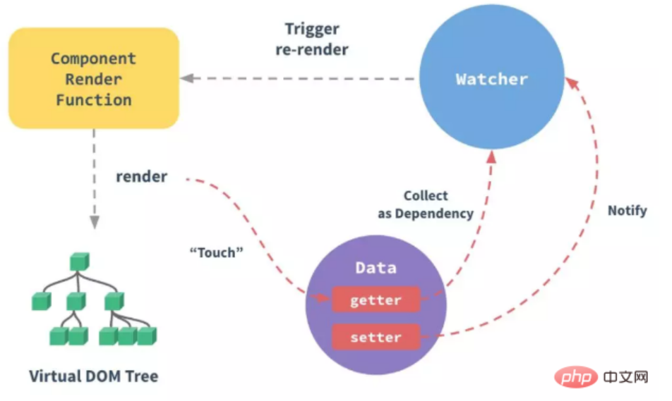
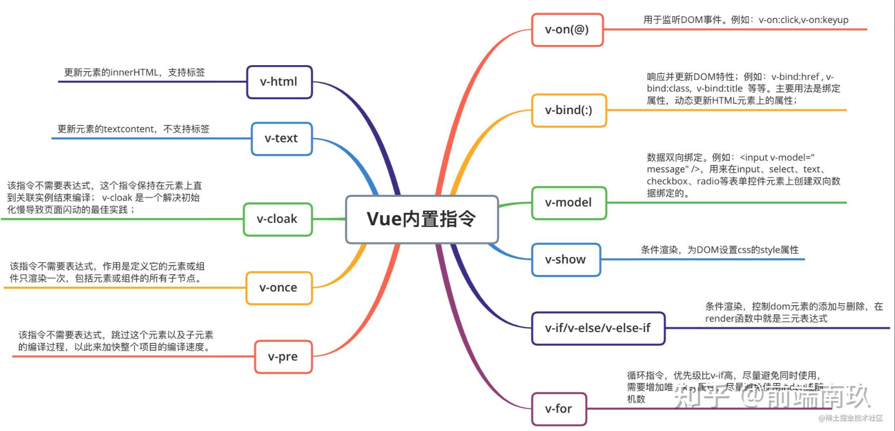

## v-show 和 v-if 的区别

v-show 是通过 css 控制 display 是否为 none，而 v-if 是动态地向 DOM 树添加或删除 DOM 元素

## 什么是 MVVM ？

是一种设计思想。model view ViewModel。即数据模型 UI 组件 通过双向数据绑定将 View 层和 Model 层连接起来

## mvvm 与 mvc 区别？它和其它框架（jquery）的区别是什么？哪些场景适用？

区别不大，都是**一种设计思想**。`mvc`中`Controller`演变成`mvvm`中的`viewModel`。主要是`mvvm`主要解决了`mvc`中大量的`DOM`操作使页面渲染性能降低，加载速度变慢，影响用户体验。它实现了 View 和 Model 的自动同步，也就是当 Model 的属性改变时，我们不用再自己手动操作 Dom 元素，来改变 View 的显示，而是改变属性后该属性对应 View 层显示会自动改变（对应 Vue 数据驱动的思想）

### Vue 并没有完全遵循 MVVM 的思想

从严格意义上来讲，MVVM 要求 View 与 Model 是不能直接通信的，而 Vue 提供了$refs 这个属性，让 Model 可以直接操作 View，违反了这一规定，所以说 Vue 没有完全遵循 MVVM。

## vuex 面试相关

### 1. `vuex`是什么？怎么使用？哪种功能场景使用它？

`vue`框架中状态管理。在`main.js`引入`store`注入。新建一个目录`store`。场景有：单页应用中，组件之间的状态，音乐播放，登录状态，家人购物车等。
应用级的状态集中放在`store`中，改变状态的方式是提交`mutations`，这是个同步的事物

### 2. `vuex`有哪几种属性？

`State` `Getter` `Mutation` `Module` `Action `

> #### - State 特性

`Vuex`就是一个仓库，仓库里面放了很多对象。其中`state`就是把数据源存放地，对应与一般`Vue`对象里面的`data`。
`state`里面存放的数据是响应式的。

通过`mapState`把全局`state`和`getters`映射到当前组件的`computed`计算属性中

> #### - Getter 特性

- `getters`是`Store`的计算属性

- `getters`可以在多组件之间复用

- 一个状态只在一个组件内使用可以不用`getters`

> #### - Action 特性

`Action`类似`mutation`，不同在于：`Action`提交的是`mutation`而不是直接变更状态，`Action`可以包含任意异步操作

> #### - 不用`Vuex`会带来什么问题？

可读性、可维护性下降。增加耦合 大量上传派发会是耦合性大大增加。

## 组件之间的传值？

① 父传子

父组件内设置要传的数据，在父组件中引用的子组件上绑定一个自定义属性并把数据 绑定在自定义属性上，子组件通过 props 方法接受数据

② 子传父

子组件通过 vue 实例方法$emit 进行触发并且可以携带参数，父组件监听使用@（v-on） 进行监听，然后进行方法处理

③ 非父子组件之间传递数据

可以使用通用的组件通讯方案：事件总线（event-bus）

## 简述 Vue 的响应式原理

当一个 Vue 实例创建时，Vue 会遍历 data 选项的属性，用 Object.defineProperty 将它们转为 getter/setter 并在内部追踪相关依赖，在属性被访问和修改时通知变化。每个组件实例都有相应的 watcher 程序实例，它会在组件渲染过程中把属性记录为依赖，之后当依赖项的 setter 被调用时会通知 watcher 重新计算，从而使它关联的组件得以更新

## v-for 中 key 的作用

key 的作用主要是为了高效的更新虚拟 DOM

## vue 中改变数组内索引的值，数据不更新，如何处理

push()、pop()、shift()、unshift()、splice()、sort()、reverse()这些方法会改变被操作的数组，filter()、concat()、slice()这些方法不会改变被操作的数组，并且返回一个新数组，并更新视图

## 常见的 vue 内置指令

