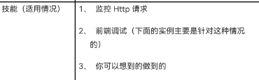
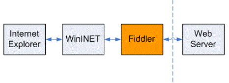
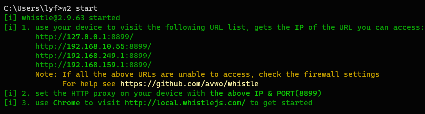
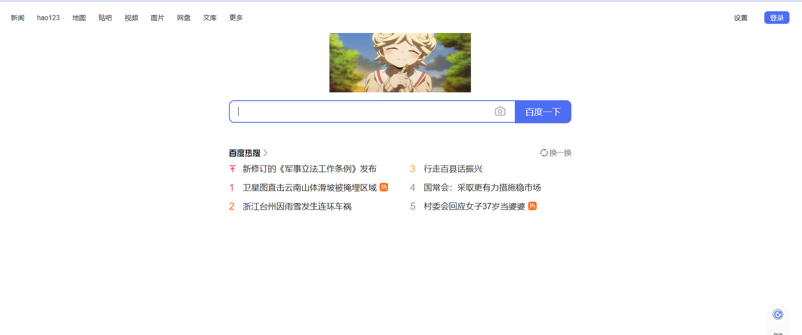
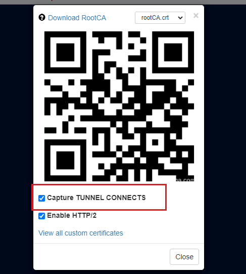

# 代理

A 负责开发 js，B 负责开发 aspx，aspx 的返回数据格式已经确定，但是在 aspx 还没有开发完成的时候，js 没有数据
现网页面出现问题，你想快速定位并解决问题（下面的实例将演示此功能）
如果有，Fiddler 将会是你最好的宝剑。(whistle 与 Fiddler 同理)

## Fiddler 为何物？

Fiddler 是用 Node 实现的类似 Fiddler 的 web 调试代理工具，支持查看和修改 HTTP(S)、Websocket 请求响应数据，且支持跨平台(Windows、Mac、Linux 等可以安装 Node 的操作系统)。
传说 Fiddler 是一个坏人，他喜欢在 C （客户端）和 S （服务器）之间做一些手脚，但是这样并不影响他的出名。请看下面的小卡片：


## Fiddler 的工作原理

从下面的图可以看到，他主要是在 WinINet API 和服务器之间做一个代理，通过定制这个代理的功能来实现上述技能。

（图片引自 http://msdn.microsoft.com/en-us/library/Bb250446.aspx）

## whistle 使用

#### 安装

```
npm i -g whistle
```

#### 运行

```
w2 start
```


到这里其实 whistle 就安装启动完毕了，直接访问http://127.0.0.1:8899 就可以看到工具界面，里面可以配置一些转发规则。

最后还需要下载个浏览器代理工具，浏览器需要把请求设置代理指向 whistle Server 地址 127.0.0.1:8899，chrome 下推荐安装使用 proxyOmega 插件来提高切换效率，这样就可以一键切换代理。

#### 界面讲解

对于新手来说，我们先熟悉下  whistle  的界面，有个大概的印象

> 以下是 whistle 的界面，常见的几个选项：

- Network——请求列表页面
- Rules——操作规则配置页面
- Values——存放 KeyValue 的系统
- Plugins——插件列表页面


#### 配置浏览器代理 proxyOmega

1. 新建情景模式
2. 命名 whistle
3. 代理协议 HTTP
4. 代理服务器: 127.0.0.1
5. 代理端口: 8899 把浏览器代理切换到 whistle 就可以进入下一步了。
   

#### 开始使用，打开网页，开始配置

点击上面的 Create 按钮新建一个规则 2，在里面写替换规则，比如：

```
https://www.baidu.com/img/PCtm_d9c8750bed0b3c7d089fa7d55720d6cf.png  /Users/lyf/Pictures/微信图片_20230904235201.jpg
```

上面的规则是：这里我把百度的 LOGO 换成我的本地图片了

在工具的请求列表也能看到被换的 RUL：

浏览器突然走不通代理？试试重启浏览器/电脑/把这个勾上，把网址从 https 改成 http 试试


### 总结

当然，这个工具的功能十分强大这里就不一一实验了。开发过程中用的最多就是这个替换 js 调试了，这里也可以看下一些其他的常用功能：

```
# whistle也支持匹配目录
qq.com/folder file://E:\xxx\dev

# 配置host也是可以的
qq.com 127.0.0.1

# 可以匹配目录到指定ip
qq.com/folder 127.0.0.1

# 一个稍微复杂的例子，用过现网路径是ke.qq.com/webcourse/index.html本地路径 E:\xxx\dev\pages\index\main.html
/^http://ke\.qq\.com/webcourse(/[\w\-]*)\.html(.*)/ file://E:\xxx\dev\pages$1\main.html

# 更详细的内容请看官方文档  https://whistle.gitbooks.io/help/content/
```
