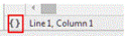
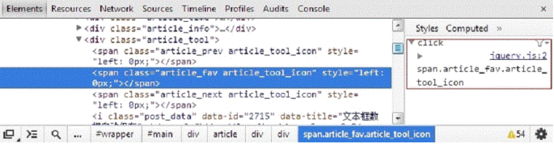
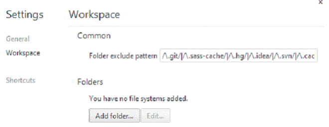
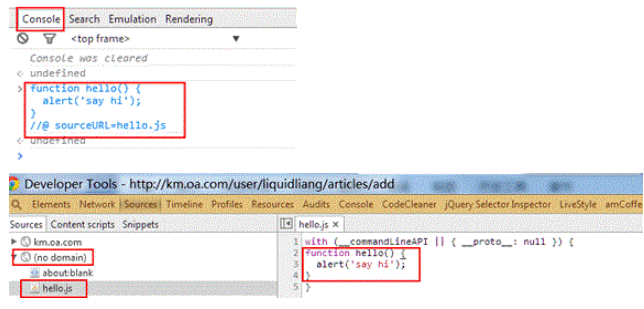

# Debug


## 1. Chrome Developer

第一步：打开 Chrome 开发工具的 sources 面板。

### 1.1 sources 面板的快捷键

- ctrl+o 打开一个 js 文件
- ctrl+p 同 ctrl+o
- ctrl+f 查找当前 js 文件中的关键字
- ctrl+shift+f 全局查找关键字
- ctrl+shift+e 在控制台运行当前选中的代码片段
- ctrl+shift+n 隐身模式，避免缓存 js 文件，但如果涉及 css 文件的改变，仍然需要关闭浏览器再打开才能看到效果。
- Ctrl/Cmd + Shift + O 在 Sources 下可以快速定位函数定义。

### 1.2 问题排查

遇到奇怪问题，先用无痕模式，确认不是插件报的。

#### 1.2.1 设断点

好在 chrome developer 有 pretty print 功能
(即格式化代码)


可以把上面的代码变成


##### 1.2.1.1 查看元素绑定的事件

在 Elements 面板, 选中一个元素, 然后在右侧的 Event Listeners（被隐藏时点击箭头可展开）下面会按类型出这个元素相关的事件, 也就是在事件捕获和冒泡阶段会经过的这个节点的事件。

在 Event Listeners 右侧下拉按钮中可以选择 Selected Node Only 只列出这个节点上的事件展开事件后会显示出这个事件是在哪个文件中绑定的, 点击文件名会直接跳到绑定事件处理函数所在行, 如果 js 是压缩了的, 可以先 Pretty print 下, 然后再查看绑定的事件。


##### 1.2.1.2Ajax 时中断

在 Scripts 面板右侧有个 XHR Breakpoints, 点右侧的 + 会添加一个 xhr 断点, 断点是根据 xhr 的 url 匹配中断的, 如果不写匹配规则会在所有 ajax, 这个匹配只是简单的字符串查找, 发送前中断, 在中断后再在 Call Stack 中查看时那个地方发起的 ajax 请求。


##### 1.2.1.3 节点元素变化触发中断

①.Elements 面板，右键元素节点选择“Scroll Into View”，可以在页面视图中快速定位到当前节点

②Elements 面板，右键元素节点选择“Break on…”则可以监听元素子元素变化，属性变化，节点被移除时触发断点 debug

找到了断点位置很大程度就锁定了问题所在代码的范围。这时，我们再运用一些调试的技巧就可以轻松找到问题所在了。

这样选择可以强制执行元素状态。

#### 1.2.2Debug

最烦就是在 for 循环中的断点了，需要不断地按下一步来在循环中找到要验证的数据。在代码中添加 debugger 的方式可以这么写：

```javascript
for (var i = 0; i < length; i++) {
  if (i === 2) {
    debugger;
  }
}
```

其实也不用这么麻烦，在断点的地方右键，选择“Edit breakpoint”就可以写上你想出现调试的条件表达式。

另外，当你在 Chrome 开发工具中配置了 workspace 之后，你就可以直接在 source 面板
上编辑代码并保存代码了，相当方便。当然，这只针对本地开发的代码，对于线上的代码就无能为力了。

具体还可以参考：https://www.cnblogs.com/jesse131/p/5288351.html

点下面的按钮开启 js 抛异常时中断的开关, 有两种模式：在所有异常处中断, 在未捕获的异常处中断. 在异常处中断后就可以查看为什么抛出异常了。


在 console 中输入代码的最后一行加上 `//# sourceURL=filename,js`,会在 Scripts 面板中有个叫 filename.js 的文件,然后他就和外部 js 文件一样了。

