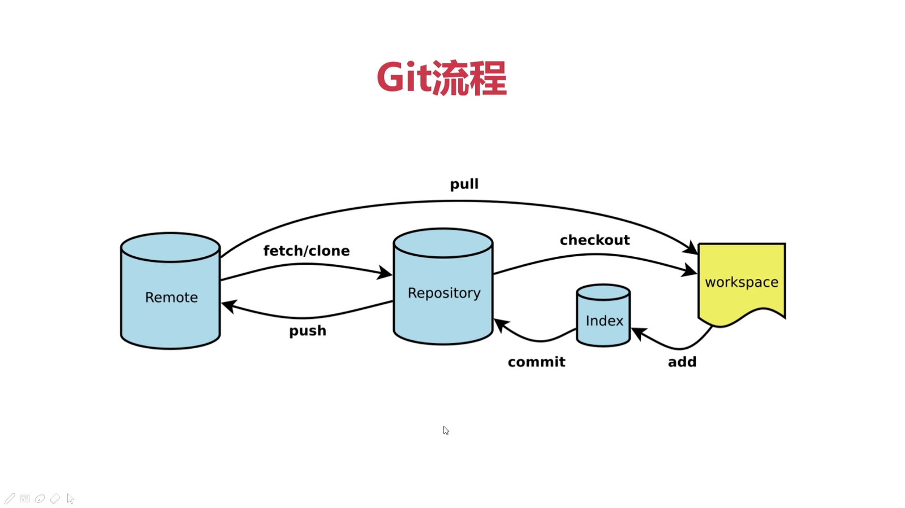
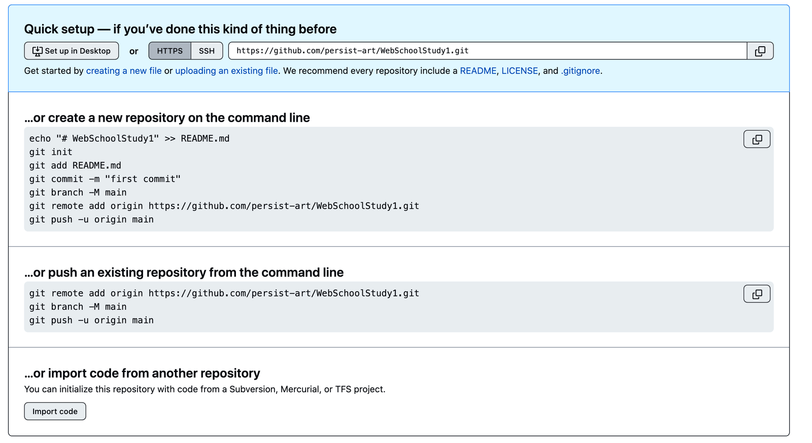
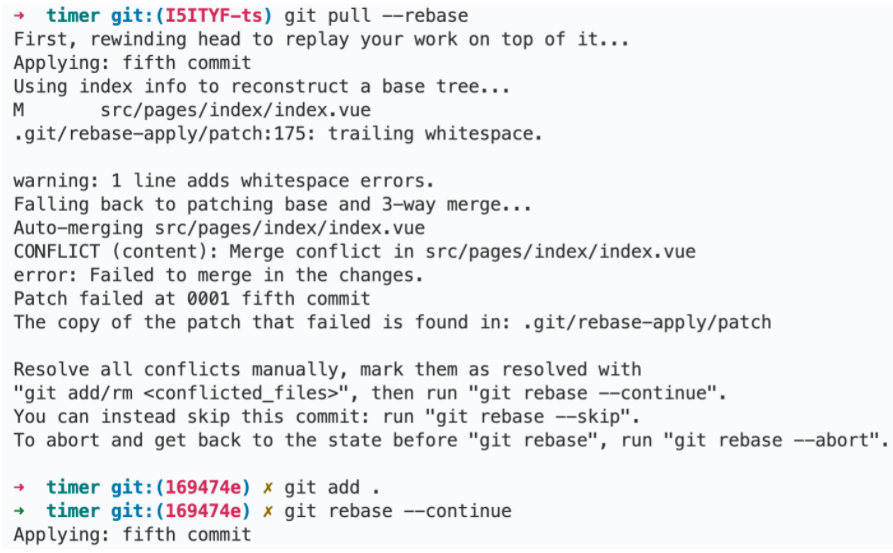
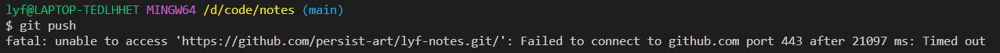
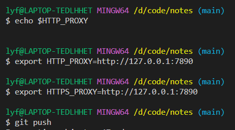

# 版本管理-Git

## 1、概览


### 常用命令
``` shell
# 查看状态
$ git status      

# 添加管理
$ git add .         # 将当前目录所有内容(文件和文件夹)添加到暂存区

# 将文件移出暂存区
$ git rm --cached filenamed

# 将暂存区的内容提交到本地仓库 （yarn lint:fix   处理eslint格式）
$ git commit -m ''
 build:用于修改项目构建系统，例如修改依赖库、外部接口或者升级Node 版本等;
 chore:用于对非业务性代码进行修改，例如修改构建流程或者工具配置等;
 ci: 用于修改持续集成流程，例如修改Travis、Jenkins等工作流配置; 
 docs:用于修改文档，例如修改README 文件、API 文档等; 
 style: 用于修改代码的样式，例如调整缩进、空格、空行等;
 refactor:用于重构代码，例如修改代码结构、变量名、函数名等但不修改功能逻辑;
 perf: 用于优化性能，例如提升代码的性能、减少内存占用等;
 test: 用于修改测试用例，例如添加、删除、修改代码的测试用例等。

# 查看提交日志
$ git log

# 打印出最近的commit messages，每条message只占一行
$ git logl（即git log--online）

# 恢复历史版本
$ git reset --hard hash(前六位)
$ git push -f origin xxx 推送到远程  

# 恢复文件
$ git checkout filename

# 查看分支
$ git branch

# 创建分支
$ git branch 分支名
# 创建+切换到新分支
$ git checkout -b [branch name]

#更新远程分支
$ git fetch origin
#或者
$ git remote update origin --prune 

# 返回上游分支
$ git checkout -

# 合并远程分支 
$ git merge 远程分支名

#删除本地已合并的分支：
$ git branch -D [branchName] 

#删除远程分支: 
$ git push origin --delete [branchname]

#推送/拉取到远程分支 git pull是两个指令的组合：git fetch和git merge
$ git push/pull origin 分支名

# 查看本地仓库关联的远程仓库
$ git remote -v

# 添加远程仓库地址 并取名 origin
$ git remote add origin url    //一般新建仓库就有，直接复制

# 创建并切换到 XXX 分支
$ git branch -M XXX

# 将本地仓库推送到远程仓库
$ git push -u origin 分支名    //一般新建仓库就有，直接复制   //git push -u origin master   主分支

#如果返回： fatal: 远程 origin 已经存在。   此时只需要将远程配置删除，重新添加即可；
$ git remote rm origin

# 从远程仓库拉取分支(更新 -> 相当于 git branch 和 git merge)
$ git pull origin master

# 保存当前未commit的代码
# 执行完这个命令后，再运行 git status 命令就会发现当前是一个干净的工作区，没有任何改动
$ git stash

# 应用最近一次的stash，随后删除该记录
$ git stash pop

# 保存当前未commit的代码并添加备注
$ git stash save "备注的内容"

# 列出stash的所有记录
$ git stash list

# 删除stash的所有记录
$ git stash clear

# 应用最近一次的stash
$ git stash apply

# 删除最近的一次stash
$ git stash drop

#代码冲突后，放弃或者退出流程：
#放弃,回到操作前的样子，就像什么都没发生过
$ gits cherry-pick --abort

#退出,不回到操作前的样子,即保留已经 cherry-pick 成功的 commit，并退出 cherry-pick 流程：
$ git cherry-pick --quit

# 查看所有tag
$ git tag -l 

# 打tag
$ git tag v1.0.0 

# 提交tag
$ git push origin v1.0.0 


# 从远程获取最新版本到本地，不会自动合并分支
$ git fetch

# 本地代码同步线上最新版本(会覆盖本地所有与远程仓库上同名的文件)；
$ git reset --hard origin/master
```

## 2、常用操作

### 2.1 修改与提交

#### 2.1.2github 操作

1. 在 github 内创建一个仓库
   

2.

```shell
git init
git add .
git commit -m "my homework"
git branch -M main
git remote add origin 地址
git push -u origin main
```

### 2.2 创建新分支

#### 2.2.1 创建+切换到新分支

git checkout -b [branch name]

#### 2.2.2 git stash

它会保存当前工作进度，会把暂存区和工作区的改动保存到一个未完结变更的堆栈中；执行完这个命令后，在运行  git status  命令，就会发现当前是一个干净的工作区，没有任何改动

#### 2.2.3git stash pop

将堆栈中最新的内容 pop 出来应用到当前分支上，且会删除堆中的记录
然后

```shell
git add .
git commit -m "2-2 checked"
git push
```

### 2.3git pull --rebase

比如当 a 修改了代码提交，b 没同步且提交就会产生冲突。所以建议试用该命令与远程代码同步，同步过程会检查冲突。

```shell
$ git pull --rebase
git pull 的默认行为是 git fetch + git merge
git pull --rebase 则是 git fetch + git rebase.
$ git fetch
从远程获取最新版本到本地，不会自动合并分支
$ git rebase
git rebase，顾名思义，就是重新定义（re）起点（base）的作用，即重新定义分支的版本库状态。
```

#### 2.3.1 处理推送冲突

执行完 `git pull --rebase` 之后如果有合并冲突，使用以下三种方式处理这些冲突：

##### 2.3.1.1abort

git rebase --abort
放弃合并，回到 rebase 操作之前的状态，之前的提交的不会丢弃；

##### 2.3.1.2skip

git rebase --skip
会将引起冲突的 commits 丢弃掉（慎用！！）；

##### 2.3.1.3continue

`git rebase --continue`

合并冲突，结合"git add 文件"命令一起用与修复冲突，提示开发者，一步一步地有没有解决冲突。（执行完`$git pull --rebase `之后，本地如果产生冲突，手动解决冲突之后，用"git add"命令去更新这些内容的索引(index)，然后只要执行:`$ git rebase --continue `就可以线性的连接本地分支与远程分支，无误之后就回退出，回到主分支上。）

<font color="red">注：</font>一般情况下，修改后检查没问题，使用 rebase continue 来合并冲突。


### 2.4 拉取指定分支

要拉取一个指定分支的代码，你可以遵循以下步骤：

1. 首先，你需要克隆远程仓库。在你的命令行界面中键入以下命令：
   `git clone https://gitee.com/persist-art/vue-ant-design.git`
   这将会在你的本地计算机上创建一个名叫 vue-ant-design 的文件夹，并且其中会包含整个仓库的内容。这个过程可能需要一些时间，具体取决于你的网络连接。
2. 接下来，进入到这个新创建的文件夹。可以使用以下命令：
   `cd vue-ant-design`
3. 现在你需要拉取所有的远程分支信息，你可以键入以下命令获取：
   `git fetch`
   这样你就能获取所有的远程分支。
4. 现在，你可以列出所有分支，包括远程分支，来查看你想要切换的分支的名字。键入以下命令可以看到所有分支的列表：
   `git branch -a`
5. 在获得了分支的名字之后，你可以使用 git checkout 命令切换到指定分支。比如你要切换到的分支名字叫做“feature”，你需要键入以下命令：
   `git checkout feature`

### 2.5 issue 的用法

git commit 的时候比如要

```shell
git commit-m'feat:添加字典管理'
```

比如我的 issue 议题是


那我要提交 issue 就在 commit 的时候后面加

```shell
git commit-m'feat:添加字典管理 #1'
```

参考：
https://blog.csdn.net/GyaoG/article/details/125713082
https://blog.csdn.net/cool99781/article/details/105821546

## 3、遇到的问题

### 3.1 push 时被墙了怎么办


只需

HTTP_PROXY 是一个常用的环境变量，用于指定 HTTP 代理服务器的地址和端口。当设置后，许多支持通过此环境变量读取代理配置的命令行工具（如 curl、wget 等）将会通过指定的代理服务器来发送 HTTP 请求。

在这个例子中，将 HTTP 代理设置为本地回环地址 127.0.0.1 的 7890 端口。这意味着执行命令时（如 curl、wget 或其他支持 HTTP 代理的工具），这些工具将会把所有的 HTTP 流量转发到本地的 7890 端口上的代理服务上。

注意，设置了此环境变量后只有支持 HTTP_PROXY 环境变量的应用程序才会使用这个代理设置。对于 HTTPS 协议的请求，通常需要设置额外的环境变量 HTTPS_PROXY 或者 ALL_PROXY 来指定 HTTPS 代理服务器。
