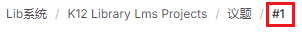

# 版本管理-Git

## 1、概览


- ll:查看当前目录
- git st（即 git status）：查看状态
- git logl（即 git log--online）：这个指令可以打印出最近的 commit messages，每条 message 只占一行
- git remote -v：查看本地仓库关联的远程仓库
- git ci -m"xxx"（即 git commit -m "first commit"）：提交【commit 是为了防止意外对视代码，但在推到远端之前最好把一次开发的 commit 合并成一个，避免污染远端的 git commit message
- git push -u origin master：推送

## 2、常用操作

### 2.1 修改与提交

#### 2.1.2github 操作

1. 在 github 内创建一个仓库
   

2.

```shell
git init
git add .
git commit -m "my homework"
git branch -M main
git remote add origin 地址
git push -u origin main
```

### 2.2 创建新分支

#### 2.2.1 创建+切换到新分支

git checkout -b [branch name]

#### 2.2.2 git stash

它会保存当前工作进度，会把暂存区和工作区的改动保存到一个未完结变更的堆栈中；执行完这个命令后，在运行  git status  命令，就会发现当前是一个干净的工作区，没有任何改动

#### 2.2.3git stash pop

将堆栈中最新的内容 pop 出来应用到当前分支上，且会删除堆中的记录
然后

```shell
git add .
git commit -m "2-2 checked"
git push
```

### 2.3git pull --rebase

比如当 a 修改了代码提交，b 没同步且提交就会产生冲突。所以建议试用该命令与远程代码同步，同步过程会检查冲突。

```shell
$ git pull --rebase
git pull 的默认行为是 git fetch + git merge
git pull --rebase 则是 git fetch + git rebase.
$ git fetch
从远程获取最新版本到本地，不会自动合并分支
$ git rebase
git rebase，顾名思义，就是重新定义（re）起点（base）的作用，即重新定义分支的版本库状态。
```

#### 2.3.1 处理推送冲突

执行完 `git pull --rebase` 之后如果有合并冲突，使用以下三种方式处理这些冲突：

##### 2.3.1.1abort

git rebase --abort
放弃合并，回到 rebase 操作之前的状态，之前的提交的不会丢弃；

##### 2.3.1.2skip

git rebase --skip
会将引起冲突的 commits 丢弃掉（慎用！！）；

##### 2.3.1.3continue

`git rebase --continue`

合并冲突，结合"git add 文件"命令一起用与修复冲突，提示开发者，一步一步地有没有解决冲突。（执行完`$git pull --rebase `之后，本地如果产生冲突，手动解决冲突之后，用"git add"命令去更新这些内容的索引(index)，然后只要执行:`$ git rebase --continue `就可以线性的连接本地分支与远程分支，无误之后就回退出，回到主分支上。）

<font color="red">注：</font>一般情况下，修改后检查没问题，使用 rebase continue 来合并冲突。


### 2.4 拉取指定分支

要拉取一个指定分支的代码，你可以遵循以下步骤：

1. 首先，你需要克隆远程仓库。在你的命令行界面中键入以下命令：
   `git clone https://gitee.com/persist-art/vue-ant-design.git`
   这将会在你的本地计算机上创建一个名叫 vue-ant-design 的文件夹，并且其中会包含整个仓库的内容。这个过程可能需要一些时间，具体取决于你的网络连接。
2. 接下来，进入到这个新创建的文件夹。可以使用以下命令：
   `cd vue-ant-design`
3. 现在你需要拉取所有的远程分支信息，你可以键入以下命令获取：
   `git fetch`
   这样你就能获取所有的远程分支。
4. 现在，你可以列出所有分支，包括远程分支，来查看你想要切换的分支的名字。键入以下命令可以看到所有分支的列表：
   `git branch -a`
5. 在获得了分支的名字之后，你可以使用 git checkout 命令切换到指定分支。比如你要切换到的分支名字叫做“feature”，你需要键入以下命令：
   `git checkout feature`

### 2.5 issue 的用法

git commit 的时候比如要

```shell
git commit-m'feat:添加字典管理'
```

比如我的 issue 议题是


那我要提交 issue 就在 commit 的时候后面加

```shell
git commit-m'feat:添加字典管理 #1'
```

参考：
https://blog.csdn.net/GyaoG/article/details/125713082
https://blog.csdn.net/cool99781/article/details/105821546
